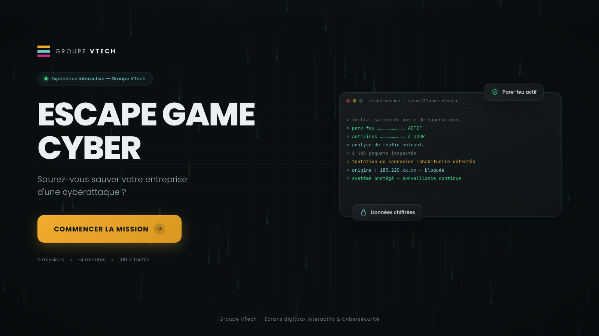

# Escape Game Cyber — Groupe VTech

Animation interactive pour écran digital tactile (salons & foires).
Site 100 % autonome : HTML + CSS + JavaScript vanilla, aucune installation requise.



## Lancer le jeu

### Sur ordinateur (Windows / macOS)

Double-cliquer sur `index.html` (Chrome ou Edge), puis passer en plein écran (`F11`).

Pour un vrai mode borne (plein écran verrouillé, sans barre d'adresse) :

```
chrome --kiosk "chemin/vers/index.html"
```

### Mode kiosk sur écran Android

La plupart des écrans digitaux interactifs tournent sous Android. Méthode recommandée :
**Fully Kiosk Browser** (Play Store), la référence pour l'affichage dynamique.

1. **Rendre le jeu accessible à l'écran** — deux possibilités :
   - *En ligne* : activer GitHub Pages sur ce dépôt (Settings → Pages → Branch `main`),
     le jeu est alors disponible sur `https://<votre-pseudo>.github.io/escape-game-cyber/` ;
   - *Hors ligne* : copier le dossier complet du projet sur l'appareil
     (par exemple dans `/sdcard/escape-game-cyber/`).
2. **Installer Fully Kiosk Browser** depuis le Play Store.
3. Dans les réglages de l'application, définir la **Start URL** :
   - l'URL GitHub Pages, ou
   - `file:///sdcard/escape-game-cyber/index.html` pour la version hors ligne.
4. Réglages conseillés pour un salon :
   - *Device Management* → **Keep Screen On** : activé (l'écran ne se met jamais en veille) ;
   - *Web Content Settings* → **Screen Orientation** : paysage ;
   - *Advanced Web Settings* → **Pull to Refresh** : désactivé (évite les rechargements accidentels) ;
   - **Kiosk Mode** : activé (version Plus) — verrouille l'appareil sur le jeu,
     sortie uniquement par code PIN.
5. Le retour automatique à l'accueil entre deux visiteurs est déjà géré par le jeu
   (`IDLE_RESET_SECONDS` dans `script.js`).

*Alternative sans application* : ouvrir le jeu dans Chrome Android et utiliser
l'épinglage d'écran (Paramètres → Sécurité → Épinglage d'application). Plus simple,
mais la barre du navigateur reste visible — pour un rendu vraiment professionnel,
préférer Fully Kiosk Browser.

## Liens à personnaliser

Ouvrir `script.js` — tout est regroupé en haut du fichier dans le bloc `CONFIG` :

| Variable | Rôle |
|---|---|
| `GUIDE_URL` | Lien du « Guide des bons réflexes cyber » (remplacer le `#`) |
| `FORM_URL` | Lien du formulaire Google (tirage au sort) |
| `IDLE_RESET_SECONDS` | Retour auto à l'accueil après inactivité (mode borne) — `0` pour désactiver |
| `SOUND_DEFAULT` | Son activé par défaut (`true` / `false`) |

## Contenu modifiable

- **Missions, choix, textes des conséquences** : tableau `MISSIONS` dans `script.js` (section 3).
- **Textes de l'introduction** : constante `INTRO_LINES`.
- **Niveaux et commentaires du score final** : constantes `SECURITY_LEVELS` et `FINAL_RANKS`.
- **Couleurs de la charte** : variables CSS en tête de `styles.css` (`--yellow`, `--gray`, `--blue`).

## Fonctionnalités

- 6 missions scénarisées avec conséquences animées (malware, propagation réseau, fraude au RIB, Wi-Fi public, ransomware, sauvegardes).
- Score sur 100, niveau de sécurité en temps réel, temps de réaction mesuré.
- Diagnostic personnalisé téléchargeable en PDF (bouton « Télécharger mon diagnostic » → boîte de dialogue d'impression → « Enregistrer au format PDF »).
- Page concours reliée au formulaire Google.
- Mode borne : retour automatique à l'accueil après inactivité, bouton son, anti-zoom tactile.
- Sons générés en interne (aucun fichier audio) — seule dépendance externe : les polices Google Fonts (le jeu reste fonctionnel sans connexion, avec les polices système).
